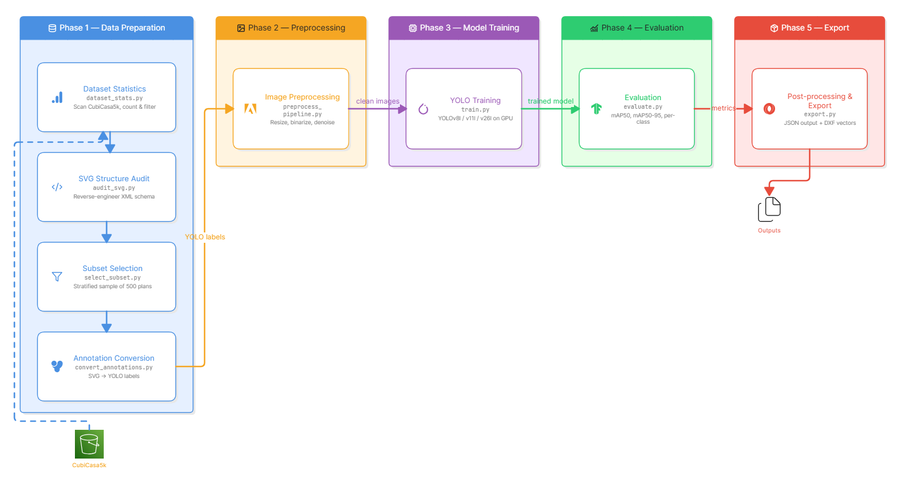

# Automated Digitization of Architectural Floor Plans

## Problem
Millions of architectural floor plans exist only as static PDFs or scanned paper
blueprints. Computers cannot read the spatial data in these images. Manual
re-digitization is slow, expensive, and error-prone. This project develops a
Computer Vision pipeline using YOLOv11 to automatically detect and extract
architectural symbols (doors, windows, walls, staircases, toilets, sinks) from
floor plan images and export them as structured CAD-compatible vector files.

## Pipeline Overview



Raw Floor Plans → SVG Audit → Dataset Statistics → Subset Selection →
SVG→YOLO Conversion → Image Preprocessing → **YOLOv11l Training** →
Evaluation → Post-Processing → JSON/DXF Export

## Documentation

| Doc | Contents |
|-----|----------|
| [docs/OVERVIEW.md](docs/OVERVIEW.md)   | Problem, architecture, classes, tech stack |
| [docs/QUICKSTART.md](docs/QUICKSTART.md) | Install and run the pipeline end to end |
| [docs/EVALUATION.md](docs/EVALUATION.md) | Metrics, results, per-class analysis |
| [docs/svg_findings.md](docs/svg_findings.md) | How the CubiCasa SVG structure was decoded |

## Quick Start

### 1. Clone and Setup
```bash
git clone https://github.com/tharUmesh/architectural-floor-plan-digitization.git
cd architectural-floor-plan-digitization
make setup
```

### 2. Configure Paths
```bash
# Edit .env with your cubicasa5k dataset location
nano .env
```

### 3. Run the Pipeline
```bash
make audit-svg       # Phase 1: Explore SVG structure
make dataset-stats   # Phase 1: Compute dataset statistics (required before selection)
make select-data     # Phase 1: Stratified subset + train/val/test split
make convert         # Phase 2: Convert SVG annotations to YOLO format
make verify          # Phase 2: Visually verify annotations
make preprocess      # Phase 3: Letterbox images to 1280x1280
make train           # Phase 5: Train YOLOv11l (run on GPU machine)
make evaluate        # Phase 6: Evaluate on the test set
make postprocess     # Phase 7: Export detections to JSON/DXF
```

The trained weights are written to `runs/detect/models/11l_final/weights/best.pt`.
Copy that file to `models/final/best.pt` to make it the canonical model used by
the evaluation, post-processing, and export scripts.

## Dataset
[CubiCasa5k](https://github.com/CubiCasa/CubiCasa5k) — 5,000 annotated
residential floor plans. Not included in this repository. Download separately
and set `CUBICASA_ROOT` in your `.env`.

## Requirements
- Python 3.10+
- CUDA-compatible GPU recommended for training (tested on RTX 5090)
- See `requirements.txt` for full dependency list

## Project Structure
```
configs/            YAML configuration files (dataset.yaml)
data/               Dataset (gitignored) and split records
docs/               Research notes and SVG findings
models/             Canonical final model (models/final/best.pt)
runs/               Training runs, evaluations, and exports (gitignored)
scripts/            One-off diagnostic scripts
src/                All source code
  data/             SVG audit, dataset stats, subset selection, annotation conversion + verify
  preprocessing/    Image preprocessing (letterboxing) + verification
  training/         Model training + hyperparameter tuning
  evaluation/       Test metrics + visual inference
  postprocessing/   Geometric refinement (wall merge/snap, scale calibration)
  export/           Vectorization → JSON / DXF CAD export
  utils/            Shared config loader + logging
tests/              Unit tests
```

## Results
Final model: **YOLOv11l** (`models/final/best.pt`). Run `make evaluate` to
regenerate test-set metrics.

| Model    | mAP@50 | mAP@50-95 |
|----------|--------|-----------|
| YOLOv8l  | 0.812  | 0.549     |
| YOLOv11l | 0.838  | 0.571     |

*Metrics are from the validation set during development; run `make evaluate`
for final test-split numbers. Full per-class breakdown in
[docs/EVALUATION.md](docs/EVALUATION.md).*

## Team

- **Tharun Umesh**
- **Keshara Gunathilaka**
- **Dilanka Hewage**
- **Ashan Munasinghe**

## License

See [LICENSE](LICENSE).